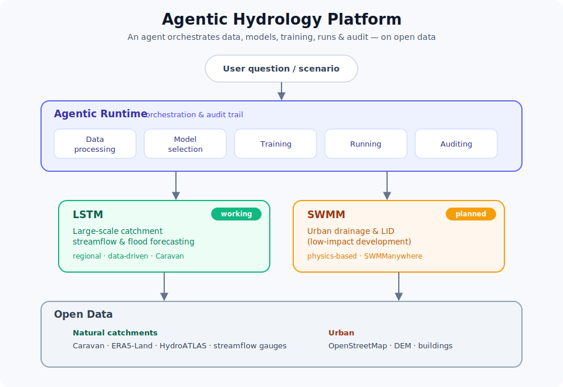
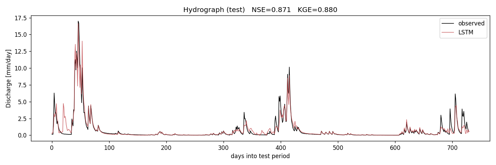

# Agentic Hydrology Platform

> An open, **agentic** platform for hydrological modelling. An **agentic runtime**
> orchestrates data processing, model selection, training, running, and auditing —
> **LSTM** predicts large-scale catchment streamflow & floods, **SWMM** models urban
> drainage & LID — all built on **open data**.

> **Status — 🚧 early, built in the open.**
> ✅ **Working today:** the LSTM runoff component — a small, from-scratch PyTorch
> LSTM reaching **NSE 0.87** on held-out years (details below).
> 🔭 **On the roadmap:** real-data regional LSTM (Caravan), the agentic runtime,
> and the SWMM urban layer. Nothing here is over-claimed — see the status column.

## Architecture



Two complementary models and a shared open-data layer, with an agent in charge:

| Layer | Responsibility | Status |
|---|---|---|
| **Agentic runtime** | data processing · model selection · training · running · **auditing** (decision + provenance log) | 🔭 planned |
| **LSTM** | large-scale / mesoscale catchment **streamflow & flood** (regional, Caravan) | ✅ sandbox → 🔭 real data |
| **SWMM** | **urban drainage & LID** (low-impact development), SWMManywhere-style auto-synthesis | 🔭 planned |
| **Open data** | Caravan · ERA5-Land · HydroATLAS · OpenStreetMap · DEM | — |

LSTM and SWMM are **complementary**: the LSTM is data-driven, fast, and strong on
gauged large-scale flow but blind inside cities; SWMM is physics-based and resolves
urban pipes & LID but needs network data (which SWMManywhere builds from open data).
The agent routes each question to the right tool — or chains them (LSTM boundary
inflow → SWMM urban detail).

→ **Full vision, component plan & references: [docs/00_architecture.md](docs/00_architecture.md)**

---

## ✅ What works today — the LSTM runoff component

A small LSTM (2 inputs: precipitation + temperature) predicting daily discharge on
**held-out test years it never saw during training**:



| Metric | Score | Reading |
|---|---|---|
| **NSE** | **0.87** | Nash–Sutcliffe Efficiency (1 = perfect, 0 = no better than the mean) |
| **KGE** | **0.88** | Kling–Gupta Efficiency |
| **r**   | **0.93** | correlation — the *timing* of peaks is right |
| **PBIAS** | **−6%** | slight underestimate of total volume |

The model captures the spring **snowmelt flood**, storm responses, and slow recession
tails — none of which a same-day model could do, because they depend on *weeks to
months* of past weather held in the LSTM's memory.

### Quickstart

```bash
python -m venv .venv && source .venv/bin/activate
pip install -e .                      # installs torch, numpy, pandas, matplotlib
python scripts/01_generate_data.py    # synthetic 40-year basin -> data/synthetic/basin.csv
python scripts/02_explore_data.py     # -> results/01_data_overview.png
python scripts/03_train_lstm.py       # train + evaluate -> results/ (NSE ~0.87)
```

~1 min on Apple-Silicon (MPS), a few minutes on CPU; reproducible (`--seed 0`).
The synthetic basin is a small conceptual model (snow + soil + groundwater), so
today's discharge genuinely depends on the weather history — the perfect sandbox
for learning *why* memory matters before moving to real data.

---

## Roadmap (component-level)

- **C1 · LSTM runoff** — ✅ synthetic sandbox (NSE 0.87) → real **[Caravan](https://www.nature.com/articles/s41597-023-01975-w)** regional model (the *"never train on a single basin"* approach) → fine-tune to a study region → flood metrics. Detailed path: **[docs/00_roadmap.md](docs/00_roadmap.md)**.
- **C2 · Agentic runtime** — a declarative *Run* (data → model → train → eval → **audit artifact**); first step = wrap C1 training as an audited, reproducible job.
- **C3 · SWMM urban** — integrate **[SWMManywhere](https://joss.theoj.org/papers/10.21105/joss.07729)** to synthesize a city drainage model from a bounding box; add LID scenarios.
- **Integration** — the agent selects & chains C1 and C3.

## Repository structure (current)

```
agentic-hydrology-platform/
├── docs/
│   ├── 00_architecture.md     # the platform vision (start here)
│   ├── 00_roadmap.md          # LSTM component learning/build path
│   ├── 01_lstm_intuition.md   # how an LSTM works + the hydrology analogy
│   ├── 02_from_llm_to_lstm.md # for people coming from OpenAI fine-tuning
│   ├── 03_hydrology_metrics.md# NSE, KGE, flood scoring
│   └── architecture.svg
├── src/lstm_hydrology/        # Component 1 — the LSTM (synthetic, soon Caravan)
├── scripts/                   # 01 generate · 02 explore · 03 train+evaluate
├── data/ · results/           # regenerable data (git-ignored) · committed figures
```

Only what exists is in the tree — components are added as they become real, not before.

## References

- Caravan — [Kratzert et al. 2023, *Sci. Data*](https://www.nature.com/articles/s41597-023-01975-w)
- Regional training — [*HESS Opinions: Never train an LSTM on a single basin* (2024)](https://hess.copernicus.org/articles/28/4187/2024/)
- SWMManywhere — [Dobson et al. 2025, *Env. Modelling & Software*](https://www.sciencedirect.com/science/article/pii/S1364815225000428)
- neuralhydrology — [docs](https://neuralhydrology.readthedocs.io)

## License

MIT — see [LICENSE](LICENSE).
