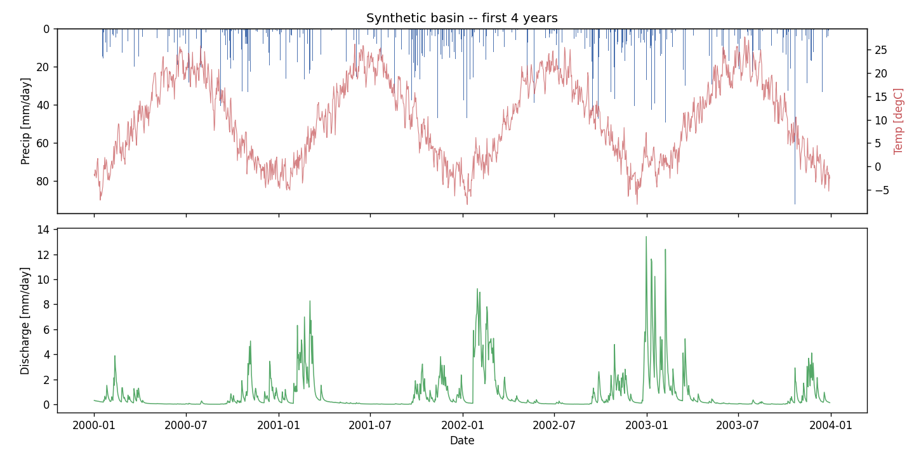

# LSTM for Hydrological Runoff & Flood Prediction

A hands-on **learning repository**: train a Long Short-Term Memory (LSTM) network
to predict river discharge from rainfall and temperature — the modern,
data-driven approach to rainfall-runoff modelling and flood forecasting.

It is built to be read and modified. You start on **synthetic data that runs in
seconds** (no multi-GB download), get a real working model, then graduate to
real catchments. If you come from **LLM fine-tuning**, there is a doc that maps
that knowledge onto this world.

## It works — here is the result

A small LSTM (2 inputs: precipitation + temperature) predicting daily discharge
on **held-out test years it never saw during training**:


| Metric | Score | Reading |
|---|---|---|
| **NSE** | **0.87** | Nash–Sutcliffe Efficiency (1 = perfect, 0 = no better than the mean) |
| **KGE** | **0.88** | Kling–Gupta Efficiency |
| **r**   | **0.93** | correlation — the *timing* of peaks is right |
| **PBIAS** | **−6%** | slight underestimate of total volume |

The model captures the big spring **snowmelt flood**, the storm responses, and
the slow recession tails — none of which a same-day model could do, because they
depend on *weeks to months* of past weather held in the LSTM's memory.

## Quickstart

```bash
# 1. environment (Python 3.9+)
python -m venv .venv && source .venv/bin/activate
pip install -e .                      # installs torch, numpy, pandas, matplotlib

# 2. the three steps
python scripts/01_generate_data.py    # synthetic 40-year basin -> data/synthetic/basin.csv
python scripts/02_explore_data.py     # -> results/01_data_overview.png
python scripts/03_train_lstm.py       # train + evaluate -> results/ (NSE ~0.87)
```

Training takes ~1 min on Apple-Silicon (MPS) or a few minutes on CPU. Everything
is reproducible (`--seed 0`). See every knob with
`python scripts/03_train_lstm.py --help`.

## What you are modelling

The synthetic basin comes from a small conceptual hydrological model (snow +
soil-moisture + groundwater stores), so today's discharge genuinely depends on
the history of weather — the perfect sandbox for learning *why* memory matters.



Notice discharge spikes in late winter **even on dry days**: winter precip was
stored as snow and is now melting. Teaching an LSTM to capture that stored-state
behavior is the whole point.

## Repository structure

```
lstm-hydrology/
├── src/lstm_hydrology/      # the small, readable library
│   ├── synthetic.py         #   conceptual rainfall-runoff data generator
│   ├── dataset.py           #   windowing + leak-free temporal split + scaling
│   ├── model.py             #   the LSTM (~30 lines)
│   ├── train.py             #   the training/prediction loop (you own it)
│   └── metrics.py           #   NSE, KGE, RMSE, PBIAS
├── scripts/                 # 01 generate · 02 explore · 03 train+evaluate
├── docs/                    # the curriculum (start here ↓)
├── data/                    # synthetic data (git-ignored, regenerate any time)
└── results/                 # committed figures + scores
```

## Learn it in order

1. **[docs/00_roadmap.md](docs/00_roadmap.md)** — the staged curriculum (Stage 0 → flood forecasting)
2. **[docs/01_lstm_intuition.md](docs/01_lstm_intuition.md)** — how an LSTM works, and why its cell state behaves like catchment storage
3. **[docs/02_from_llm_to_lstm.md](docs/02_from_llm_to_lstm.md)** — for people coming from OpenAI fine-tuning
4. **[docs/03_hydrology_metrics.md](docs/03_hydrology_metrics.md)** — NSE, KGE, and how floods are scored

Then **run the Stage 2 experiments** (`--seq-len 10`, `--features precip`,
`--target-transform none`, different `--seed`s) and predict each result before
you run it. That is where the intuition forms.

## Graduating to real data

When the synthetic sandbox feels easy, the same code carries over to real
catchments — only the data loader changes:

- **[CAMELS](https://ral.ucar.edu/solutions/products/camels)** — large-sample catchment datasets (US, GB, BR, AUS, CL, …), the benchmark for this field.
- **[neuralhydrology](https://neuralhydrology.readthedocs.io)** — the reference PyTorch library for multi-basin LSTM hydrology (same ideas as here, plus static attributes, the NSE loss, and CAMELS loaders).

## References

- Kratzert et al. (2018), *Rainfall–runoff modelling using LSTM networks*, HESS — [doi:10.5194/hess-22-6005-2018](https://doi.org/10.5194/hess-22-6005-2018)
- Kratzert et al. (2019), *Towards learning universal, regional, and local hydrological behaviors via ML*, HESS — [doi:10.5194/hess-23-5089-2019](https://doi.org/10.5194/hess-23-5089-2019)

## License

MIT — see [LICENSE](LICENSE).
