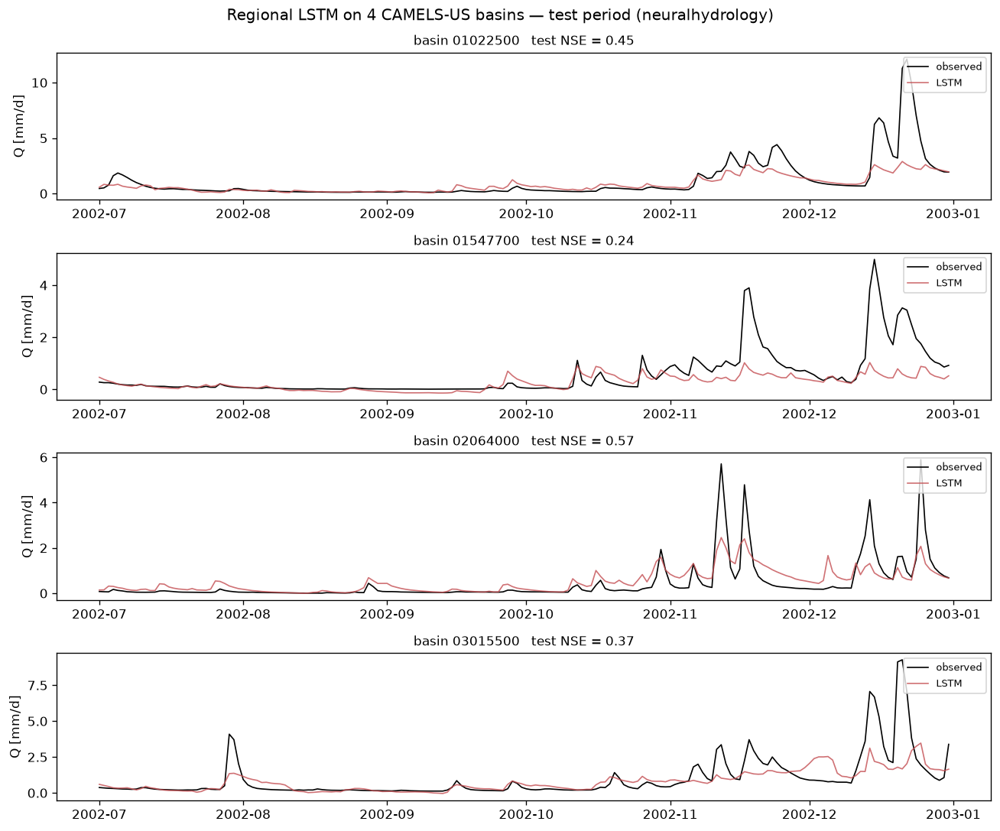

# Real-data pipeline smoke test — neuralhydrology + CAMELS-US

**Component 1 milestone.** Proves the full regional-LSTM workflow on *real* data
with ~no download, before scaling to cloud Caravan.

## What this is

A regional LSTM trained **jointly on 4 real CAMELS-US basins** (the sample bundled
with neuralhydrology's own tests), using daymet + maurer + nldas forcings, static
catchment attributes, and the **basin-averaged NSE loss**. It exercises the whole
chain: config → train → evaluate → per-basin metrics.

⚠️ **This is a plumbing check, not a performance result.** 4 basins, 2 years of
training, a 6-month test window — far too little data for skill. Real performance
(NSE 0.7+) needs the long, many-basin records we get next from **cloud Caravan**.
The point is that the *same workflow* then scales by swapping only the data source.

## Results — test period (Jul–Dec 2002)

| basin | NSE | KGE |
|---|---|---|
| 01022500 | 0.45 | 0.30 |
| 01547700 | 0.24 | 0.09 |
| 02064000 | 0.57 | 0.49 |
| 03015500 | 0.37 | 0.34 |
| **median** | **0.41** | **0.32** |



## Reproduce

neuralhydrology needs **Python 3.10+**, so it lives in a separate `.venv-nh`
(the synthetic sandbox stays on the 3.9 `.venv`):

```bash
python3.11 -m venv .venv-nh && .venv-nh/bin/pip install -U pip neuralhydrology
bash experiments/real_smoketest/prepare_data.sh          # fetch the 4-basin sample (~1.5 MB)
.venv-nh/bin/nh-run train    --config-file experiments/real_smoketest/config.yml
.venv-nh/bin/nh-run evaluate --run-dir experiments/real_smoketest/runs/<run_dir> --period test
.venv-nh/bin/python experiments/real_smoketest/summarize.py
```

## What changes for real Caravan (next step)

Same config — swap only the data block: `dataset: caravan`, point `data_dir` at a
Caravan slice (pulled per-basin from the public GCS **zarr** store, a few MB each),
list its basin IDs, and widen the date periods. Model, training, and evaluation
code are unchanged — that is exactly why we use neuralhydrology.

## Files

| file | purpose |
|---|---|
| `config.yml` | the neuralhydrology experiment config |
| `prepare_data.sh` | fetch the 4-basin CAMELS-US sample (git-ignored) |
| `summarize.py` | per-basin metrics + hydrograph figure |
| `results/` | committed metrics (`test_metrics.csv`) + figure |
| `runs/` | neuralhydrology outputs (git-ignored) |
